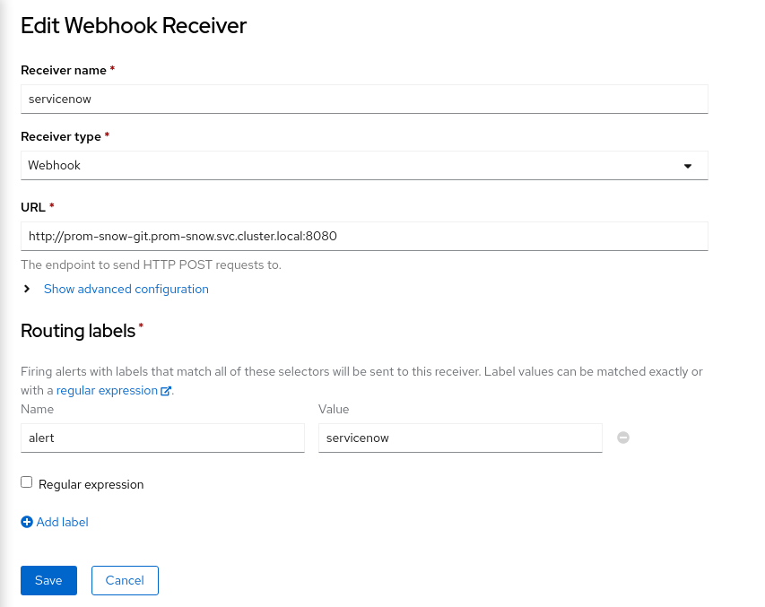
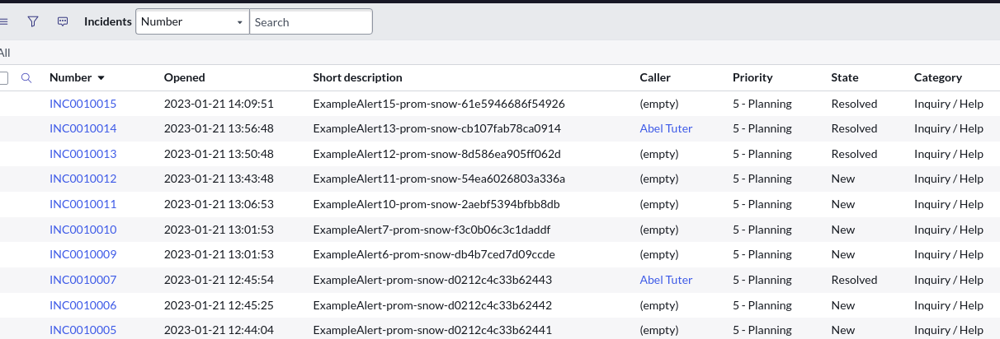

# Connecting your Prometheus alerts to an API-based ITSM tool / Servicenow

## Overview

The article describes a mechanism to proxy a simple webhook to various ITSM tools.

In this article today, we are going to integrate openshift based prometheus to Service now. [ The process is similar to any API-enabled ITSM tool]

### Prerequisite

- Assumes you have a fully configured prometheus instance, with alerting enabled on the target namespace where you are creating the alerts
- Assumes you have a basic understanding of the openshift monitoring stack
- Assumes you have a working instance of ServiceNow or any other ITSM tool which can be managed via API
- Assumes you have an understanding of nodejs

## Source Code Example

The git repo with the sample template to be configured is [provided here for reference](https://github.com/gauravshankarcan/prom-snow)


## Constructing the Proxy to your ITSM tool

We will use a developer instance of SNOW/service now for showing the construction, but the logic is essentially the same for any ITSM tool

The git repo contains an app folder that has a simple 1-page nodejs code which we will be using to construct a docker image to be customized for your needs.

### Let's prepare the server.js file

Open up the file app/server.js  this file contains an express-based app that receives data as a webhook from prometheus.  

> Note: At a later point of this article we will show how to configure prometheus webhooks on openshift 

The request we receive from Prometheus is a post request hence we use the simple function, which captures the body of the post and sends it to be parsed by the requestParse function

To view a sample request body format sent by, refer to the [webhook configurations](https://prometheus.io/docs/alerting/latest/configuration/#webhook_config) 

```javascript
app.post('/',jsonParser, async (req, res) => {
  await requestParse(req.body)
  res.send('Success');
});
```
The file contains 5 essential functions
- requestParse
- itsmLogin
- constructUniqueString
- searchQuery
- createRecord/UpdateRecord/DeleteRecord

we will be going through each of the above to configure and customize to your needs

#### Request Parser

This is the main control function that decides the kind of operations which needs to be performed.

The webhook body is received from prometheus and contains multiple alerts that are grouped together, hence it is necessary to write a for loop on the alert section . However, before we iterate on the foreach loop we perform a login.

Here is a sample request received

```json
{
  "receiver": "servicenow",
  "status": "firing",
  "alerts": [
{
      "status": "firing",
      "labels": {
        "alert": "servicenow",
        "alertname": "ExampleAlert",
        "namespace": "prom-snow"
      },
      "annotations": {},
      "startsAt": "2023-01-19T21:22:07.846Z",
      "endsAt": "0001-01-01T00:00:00Z",
      "generatorURL": "https://thanos-querier-openshift-monitoring.apps-crc.testing/api/graph?g0.expr=vector%281%29&g0.tab=1",
      "fingerprint": "d0212c4c33b62441"
    }
  ],
  "groupLabels": {
    "namespace": "prom-snow"
  },
  "commonLabels": {
    "alert": "servicenow",
    "namespace": "prom-snow"
  },
  "commonAnnotations": {},
  "externalURL": "https:///console-openshift-console.apps-crc.testing/monitoring",
  "version": "4",
  "groupKey": "{}/{alert=\"servicenow\"}:{namespace=\"prom-snow\"}",
  "truncatedAlerts": 0
}
```

After the login function `itsmLogin`, for each alert, we need to create a unique fingerprint which is a unique identifier used to query the ITSM server to decide, if a request has to be created, updated, or marked as closed.

The unique string which determines the kind of operation that is needed to be performed is done by `constructUniqueString` function.

The `searchQuery` function returns a search result from ITSM tool to see if a record exists and helps decide the type of operation which needs to be performed. The `if else conditions` are a mechanism to decide the operation using the search results.

```javascript
// The Request parse function
const requestParse = async (body) => {
  const login = await itsmLogin();
  body.alerts.forEach(async (alert) => {
        try {    
                  console.log(alert)
                  const result = await searchQuery(login,constructUniqueString(alert))
                  if(result.length == 0 && alert.status === "firing") {  // no record exists create new record
                    await createRecord(login,constructUniqueString(alert),alert)
                  } else if(result.length == 1 && alert.status === "firing") { // update record with last info
                    await updateRecord(login,result[0].sys_id,alert)
                  } else if(result.length == 1 && alert.status === "resolved") { // resolve record
                    await closeRecord(login,result[0].sys_id,alert)
                  } else { // somthing is wrong
                    console.log("more than 1 record found for search criteria")
                    console.log(alert)
                    console.log("Search string: "+constructUniqueString(alert))
                  }
         }
         catch (e) {
          console.log(e)
         }
    });
};
```

#### Itsm Login function

This function is fired once per webhook received from prometheus and is responsible for login into your ITSM.  Depending on the ITSM tool / Auth method you choose, the rest request may change.
The end goal of this request is to return a Bearer token for further calls 

> Note:  all the variables can be replaced by environment data using `process.env.VARIABLE_NAME`  hence collecting data from container/pod environment . This can be injected via standard mechanisms like secret/config maps etc 

```javascript

//Authentication into your ITSM tool

const  itsmLogin = async () => {
  const itsmLoginRequestConstruct ={
    baseURL: "https://dev105291.service-now.com/oauth_token.do",
    method: "POST",
    rejectUnauthorized: false,
    data: querystring.stringify({
      grant_type: 'password',   
      client_id: '<sample>', // Process.env.client_id  to obtain from environment variables
      client_secret: '<sample>', // Process.env.client_secret  to obtain from environment variables
      username: '<sample>', // Process.env.username  to obtain from environment variables
      password: '<sample>'  // Process.env.password  to obtain from environment variables
      }),
    headers: {
      'Content-Type': 'application/x-www-form-urlencoded'
    }      
  }
  const login = await axios.request(itsmLoginRequestConstruct)
  return login.data
}
```

#### Construct Unique fingerprint

This function has an input variable of the alert json and returns a unique string that is used to create or find a unique ticket on your ITSM tool.

> Note: Ensure this string is unique enough such that ITSM will never return more than 1 record

```javascript

// the below function returns a unique string per alert raised/resolved.

const constructUniqueString = (alert) => {
  return  alert.labels.alertname +"-"+ alert.labels.namespace+"-"+alert.fingerprint
}
```

#### The search criteria

This function searches the ITSM tool 

The request object can be constructed in many ways to suit your needs, in the case below my unique Identifier is `short_description` field. The REST call can be constructed to search for any field which contains the unique string, however, ensure the query only returns a max of 1 records.

The header is populated with the login token obtained from Login Function

```javascript
  const itsmSearchConstruct ={
    baseURL: "https://dev105291.service-now.com/api/now/table/incident",
    method: "GET",
    rejectUnauthorized: false,
    params: {
      sysparm_limit: 10,
      short_description: uniqueString
    },
    headers: {
      'Content-Type': 'application/x-www-form-urlencoded',
      'Authorization': 'Bearer '+login.access_token
    }      
  }
  const searchResult = await axios.request(itsmSearchConstruct)
  return searchResult.data.result
```

### The Create / Update and closed methods

These 3 functions represented by `createRecord`, `updateRecord` and `closeRecord` in the server.js file execute based on the control function `requestParse` . 

When creating a new record ensure the unique fingerprint is set on any field, such that the search function `searchQuery`` can retrieve the record using the unique fingerprint field.

Ensure the Update record does not modify the unique field, however, all other fields in the ITSM record are capable of being modified. 

The resolve function will usually be triggered by the last call made by prometheus with that fingerprint. 

Prometheus sets `alert.status` to resolved. this is a clear indication that the request or incident can be resolved.

## Build the proxy and generating the test alert

Let's build a proxy app using the docker image
Sample Dockerfile is the app folder. you can build the image and deploy after configuring it based on the above steps. Ensure all the credentials are passed as environment variables as secrets.

Let create an alert with label matchers  ``alert=servicenow``

```yaml
apiVersion: monitoring.coreos.com/v1
kind: PrometheusRule
metadata:
  creationTimestamp: null
  labels:
    prometheus: example
    role: alert-rules
  name: prometheus-example-rules
spec:
  groups:
  - name: ./example.rules
    rules:
    - alert: ExampleAlert
      expr: vector(1)
      labels:
        alert: servicenow  ### this is a unique identifier to send requests on the webhook , this should match the next steps
```

create a receiver of type webhook

> your url may be different based on your service.
Depending on how you have set up the service you may want to add

```
http://<svc>:port  in the url below
```



The moment alert fires next you will notice the output in the logs of the proxy container.

This is the indication that the proxy image has received the webhook and will start the sending process to service now. Once the request has been completed, you should see the request in service now

Similarly, once the alert has been resolved, the servicenow record would also resolve. ( make take a few minutes for prom to detect the alert resolution and send the webhook.)



## Summary

That was lot of info, but once you have built it, It will have long-term benefits of being able to integrate alerting in your existing servicenow incident process flow.

Any labels set on the prometheus alerts are passed onto the webhook body, similar to `alert=servicenow`, you can set additional labels like description / short_description / owner /close notes to be added when resolved etc, and pass it to the webhook and set it using the create/update/resolve functions on to the ITSM record. 